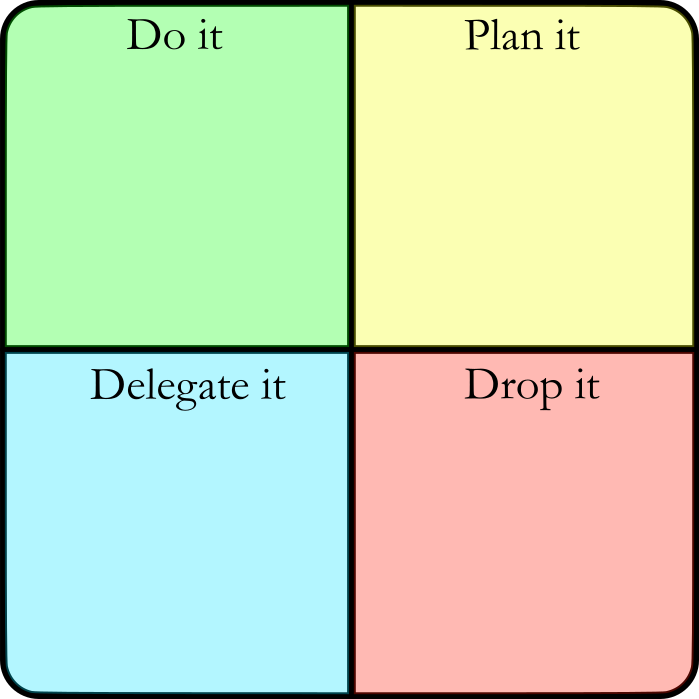

# Eisenhower-box
There is a system for organizing a series of projects or items to get done, the system is called the Eisenhower Box. The intention for this project is to create an interactive, streamlined GUI where a user can add items to one of five squares: Do it, Plan it, Delegate it, Drop it, or Done it.

![Done column](Done column.png
